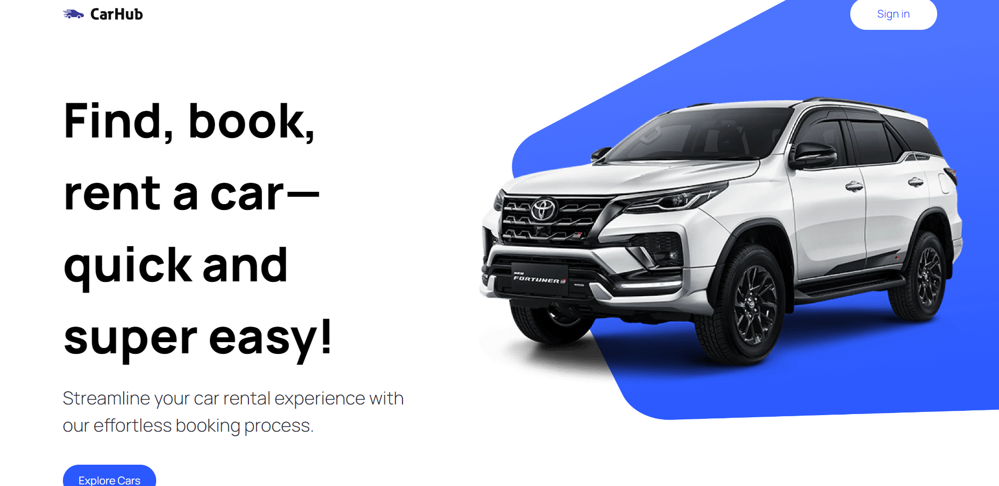

# :desktop_computer: Car Hub Application

## :fire: Run

- Development (Port 3000): `yarn dev`

## :triangular_flag_on_post: Environment Variables

- Rapid API KEY: `NEXT_PUBLIC_RAPID_API_KEY`
- Rapid API HOST: `NEXT_PUBLIC_RAPID_API_HOST`
- Rapid API URL: `NEXT_PUBLIC_RAPID_API_URL`
- Imagin API KEY: `NEXT_PUBLIC_IMAGIN_API_KEY`
- Imagin API URL: `NEXT_PUBLIC_IMAGIN_API_URL`
